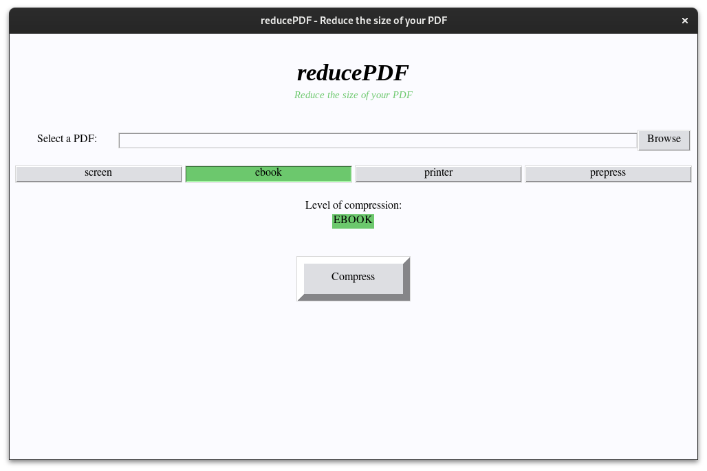

# reducedPDF

**reducedPDF** is a Python-based graphical user interface (GUI) application that simplifies the process of compressing PDF files using `goscript`. This tool is ideal for users who may not be comfortable with command-line tools like `goscript` but still need to reduce the size of their PDFs.

## Installation and Usage

To start using **reducedPDF**, follow these steps:

### 1. Clone the Repository
First, clone the repository to your local machine:
```shell
git clone https://github.com/PixelTux/reducedPDF-python.git
```

### 2. Navigate to the Project Folder
Move into the project directory:
```shell
cd reducedPDF-python
```
### 3. Run the Application
Execute the Python script to launch the application:

```shell
python reducedPDF.py
```
Below is a screenshot of the reducedPDF interface:

